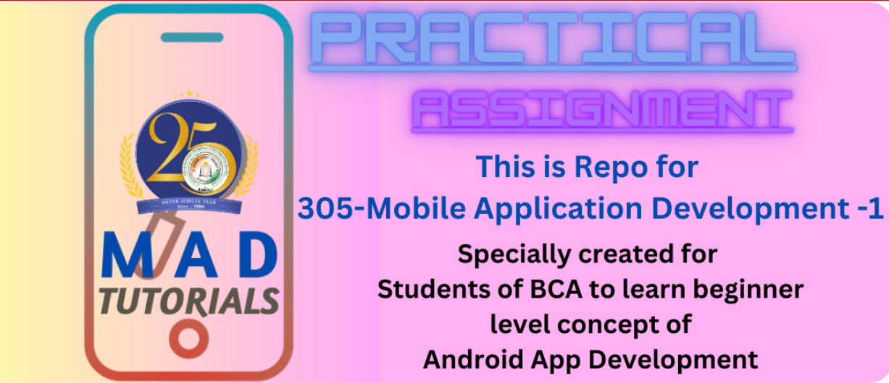

# Practical_Assignment

Welcome to the Android Practical_Assignment 305 MAD-1 Tutorial Demo repository! This project serves as a starting point for Android app development and provides hands-on examples and tutorials for beginners.



## Table of Contents

- [Getting Started](#getting-started)
- [Features](#features)
- [Tutorials](#screenshots)
- [Contributing](#contributing)
- [License](#license)

## Getting Started

Follow these steps to get this Android app up and running on your local machine.

### Prerequisites

- Android Studio: Make sure you have [Android Studio](https://developer.android.com/studio) installed.
- Android Emulator or a physical Android device for testing.

### Installation

1. Clone this repository to your local machine using `git clone`:

   
   ```bash
   git clone https://github.com/sbccas/Practical_Assignment.git

### Open the project in Android Studio.

### Build and run the app on your emulator or Android device.

## Features

### Feature 1: Describe a key feature of your app.
### Feature 2: Highlight another important functionality.
### Feature 3: You can list more features here.
### Screenshots
   Screenshot 1
   Screenshot 2

## Contributing
   We welcome contributions to improve this Android tutorial demo. To contribute:

## Fork this repository.
   Create a new branch for your feature: git checkout -b feature-name
   Make your changes and commit them: git commit -m 'Add some feature'
   Push to your forked repository: git push origin feature-name
   Create a pull request to this repository.
## License
   This project is licensed under the MIT License.

## Acknowledgments
   Acknowledge any third-party libraries or resources used in your project.
## Contact
   If you have questions or need further assistance, feel free to contact us at info@amrolicollege.ac.in

## Happy coding!
